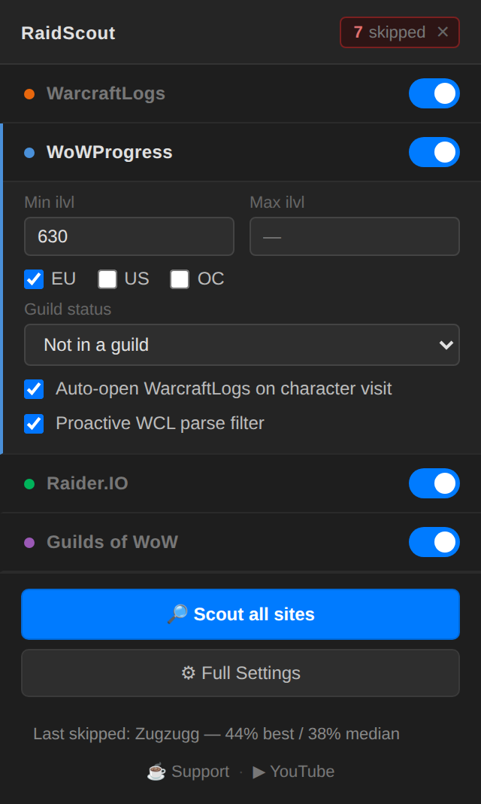
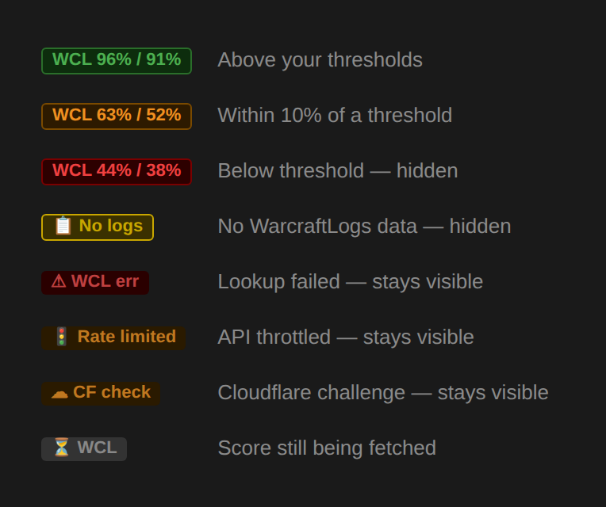

<h1 align="center">RaidScout</h1>

<p align="center">
  
</p>

<p align="center">
  A Chrome extension that streamlines World of Warcraft guild recruitment.<br>
  Filter candidates on WoWProgress, Raider.IO and Guilds of WoW by item level,
  class, role and WarcraftLogs parse — or pull all four into one ranked list.
</p>

<p align="center">
  <a href="#installation">Install</a> ·
  <a href="#quick-start">Quick start</a> ·
  <a href="docs/scout.md">Scout</a> ·
  <a href="docs/warcraftlogs-api.md">Parse filtering</a> ·
  <a href="docs/settings.md">Settings</a> ·
  <a href="docs/troubleshooting.md">Troubleshooting</a>
</p>

---

## What it does

Recruiting means reading the same handful of listing sites over and over, then
opening a WarcraftLogs tab per candidate to find out most of them aren't worth
the click. RaidScout removes both halves of that.

|  | |
|---|---|
| **Filter the lists** | Item level, class, role, region and guild status on each site's own recruitment page, applied as the page loads |
| **Filter by parse** | With a free WarcraftLogs API key, look up parses *before you click* and hide anyone under your thresholds — with per-role thresholds, since healer HPS and DPS parses aren't the same number |
| **Skip the dead ends** | Visiting a character auto-opens their WarcraftLogs page — but only if they pass. Below-threshold candidates never open a tab at all |
| **[Scout](docs/scout.md)** | One button pulls every configured site, de-duplicates people advertising on several at once, scores them, and hands you a sortable, exportable list |

Free, open source, no ads, no telemetry, no accounts. Nothing leaves your
machine except the character lookups you make with your own API key.

---

## Installation

No build step — the extension loads directly from source.

1. Clone or [download this repository](../../archive/refs/heads/main.zip) and unzip it
2. Open Chrome and go to `chrome://extensions/`
3. Enable **Developer mode** (top-right)
4. Click **Load unpacked** and select the repository root folder

The RaidScout icon appears in your toolbar — pin it.

To install a packaged build instead, download the `.zip` from the
[Releases page](../../releases) and drag it onto `chrome://extensions/`.

---

## Quick start

Click the icon. The popup auto-expands the panel for whichever site you're on,
and every change saves itself.



**Basic filtering** — no API key needed:

1. Set your filters in the popup; they apply immediately
2. Visit a character on WoWProgress or Raider.IO and their WarcraftLogs tab opens automatically
3. If their parse is under your threshold, that tab closes itself

**Parse filtering** — needs a free WarcraftLogs API key:

1. Follow the [API setup guide](docs/warcraftlogs-api.md) (about two minutes)
2. Set your thresholds once, then switch on **Enable proactive WCL filtering** per site
3. Below-threshold candidates are now hidden before you ever click, and everyone
   else carries a parse badge



---

## Scout

**🔎 Scout all sites** in the popup harvests every configured site in one pass,
merges people who are advertising on more than one, scores them all, and gives
you a single ranked table you can filter, copy as a whisper list, or export to
CSV.


Full details: **[docs/scout.md](docs/scout.md)**

---

## Sites

| Site | What RaidScout does there |
|---|---|
| **WoWProgress** | Filters the LFG table by region, item level range, class and guild status. Auto-opens WarcraftLogs from character pages |
| **Raider.IO** | Filters guild recruitment search by item level, region, role and class. Enforces sort-by-newest, hides ads, auto-opens WarcraftLogs |
| **Guilds of WoW** | Filters recruit cards by item level, mythic kills, M+ score, class and role |
| **WarcraftLogs** | Auto-closes tabs for below-threshold candidates; filters the recruitment search by parse, region, class and mythic kills |

All three listing sites also support proactive parse filtering and inline badges
once you've [set up an API key](docs/warcraftlogs-api.md).

---

## Documentation

| | |
|---|---|
| **[Scout](docs/scout.md)** | How a run works, filters, listing URLs, the candidate cap |
| **[WarcraftLogs API & parse filtering](docs/warcraftlogs-api.md)** | Credential setup, per-role thresholds, badges, what gets hidden |
| **[Settings reference](docs/settings.md)** | Every setting, by tab |
| **[Troubleshooting](docs/troubleshooting.md)** | When something doesn't behave |
| **[CLAUDE.md](CLAUDE.md)** | Architecture, storage keys, debugging, known quirks |
| **[CHANGELOG.md](CHANGELOG.md)** | Version history |

---

## Development

No build system. Edit the source and hit reload on `chrome://extensions/` —
content scripts and the popup pick changes up immediately; the background
service worker needs **Inspect → reload**.

```sh
npm install
npm test      # Vitest
```

270 tests cover the filtering and scoring decision logic, the pre-flight
verdict, the WarcraftLogs API client, Scout's merge/dedupe/sort core, the
WoWProgress HTML parser and the settings schema. CI runs the same suite and
blocks the packaged artifact if it fails.

The documentation screenshots are generated rather than hand-captured — see
[`tools/screenshots.mjs`](tools/screenshots.mjs) for how to regenerate them
after a UI change.

---

## Support

If RaidScout saves you time recruiting:

- ☕ [Support development](https://tinyurl.com/donatetochambers)
- ▶ [Subscribe on YouTube](https://tinyurl.com/subtochambers)

Both links also appear in the popup, the Scout footer and Full Settings. They're
plain links — no tracking, no third-party scripts.

Bugs and feature requests: [open an issue](https://github.com/MChambers1992/RaidScout/issues).

---

## License

[MIT](LICENSE) — © 2026 Michael Chambers. Use, modify and redistribute freely,
including commercially, provided the copyright notice and licence text travel
with it.

RaidScout is an unofficial fan project, not affiliated with or endorsed by
Blizzard Entertainment, WarcraftLogs, WoWProgress, Raider.IO or Guilds of WoW.
World of Warcraft is a trademark of Blizzard Entertainment, Inc.
