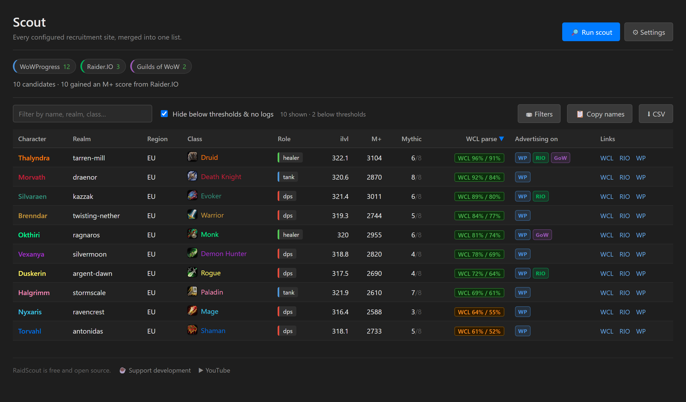
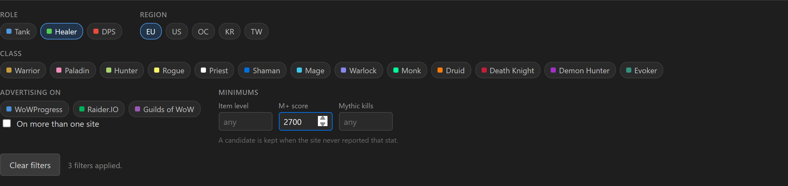
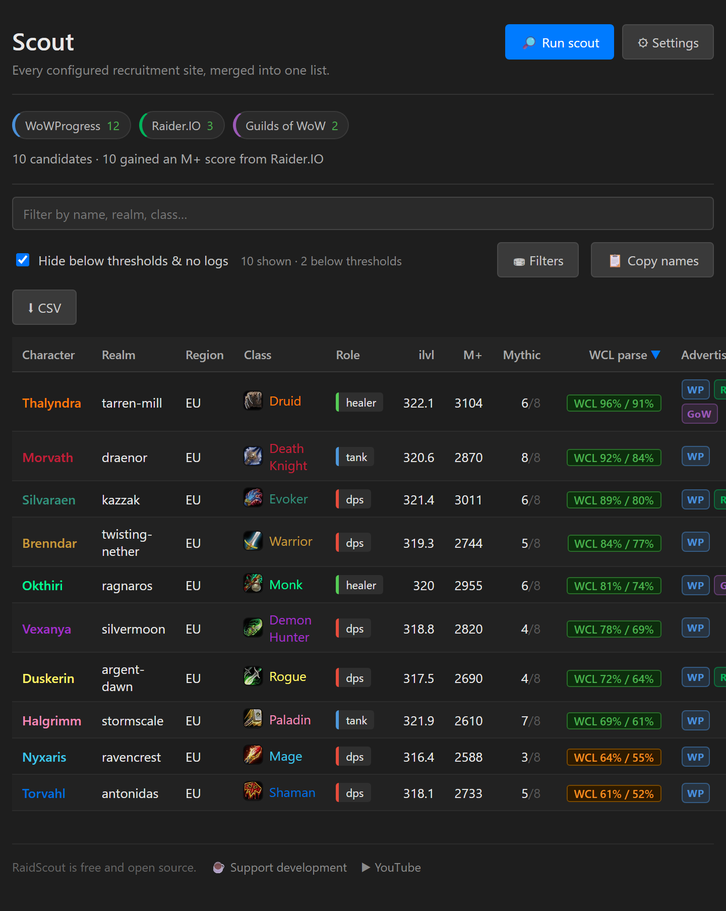

# Scout — every site in one list

[← Back to README](../README.md)

Scout answers one question: *who is looking for a guild right now that meets my
criteria?* — without opening three sites and reading three different layouts.

Click **🔎 Scout all sites** in the popup.

---

## What a run does

1. **Harvests** every source you've enabled. WoWProgress is read directly over
   the network. Raider.IO and Guilds of WoW render their listings in the
   browser, so Scout opens each in a background tab for a few seconds, lets
   RaidScout's own content script filter it exactly as it would for you, reads
   the surviving rows and closes the tab.
2. **Filters** each site by that site's own settings — the item level, class,
   role and region filters you already configured in its tab.
3. **De-duplicates** across sites. The same player advertising on WoWProgress
   *and* Raider.IO *and* GoW becomes one row, and the **Advertising on** column
   names all three — being on three sites at once is itself a signal they're
   actively looking.
4. **Scores** each unique player once through the WarcraftLogs API, with the
   same role-aware thresholds, 6-hour cache and rate-limit backoff as
   [proactive filtering](warcraftlogs-api.md). This runs first because it is
   what decides who you look at, and it is the faster of the two lookups.
5. **Cross-references** the candidates that survived against Raider.IO's
   public character API, to fill in M+ score, mythic progress and item level
   (see below). Only the survivors, because looking someone up after the
   thresholds rejected them spends a request on a row you won't see.
6. **Ranks** everyone in a sortable table you can search, filter, copy as an
   in-game whisper list, or export to CSV.

---

## Every candidate gets the same columns

The three sites publish wildly different stats. A WoWProgress row has an item
level and nothing else — no M+ score, no raid progress. Raider.IO's search table
adds a role. Only Guilds of WoW prints all three. So a blank M+ cell used to
mean *"the site they happened to post on doesn't print that"*, which tells you
nothing about the player.

**Cross-reference stats with Raider.IO** (Settings → Scout, on by default) looks
every candidate up on Raider.IO's public character API and fills in the gaps:
M+ score, current-tier mythic kills, item level, class and spec. It needs no API
key and no sign-in.

Two rules keep it from doing harm:

- **It only fills gaps and refreshes numbers.** A stat takes whichever reading
  is higher, since gear and progress only go up. A role a site *stated* is never
  overwritten — that came from the recruit's own advert, whereas Raider.IO
  reports whichever spec they last logged out in.
- **A failed lookup changes nothing and says nothing.** Raider.IO has never
  heard of plenty of legitimate fresh alts, so a miss simply leaves the row as
  the listing described it rather than raising a warning you can't act on.

Class and role also come free where they can be deduced: hunters, mages, rogues
and warlocks have no tank or healer specialisation, so knowing the class settles
the role outright — no markup guessing, no API call.

Mythic progress is shown as a fraction — **6/8**, not 6 — because a kill count
means nothing without the tier's boss count, and that count changes every
raid. Candidates whose kills came from a listing that prints no total show
the bare number.

Turn it off if you'd rather the run finish faster, or if you only care about
parses.

---

## Why WarcraftLogs isn't a source

Scout harvests names from WoWProgress, Raider.IO and Guilds of WoW. It used to
read the WarcraftLogs recruitment page too, by opening it in a background tab —
and that was the least reliable part of a run, because WarcraftLogs sits behind
an aggressive Cloudflare configuration. The source that most needed a browser tab
was the one most likely to be handed a security check instead of a listing.

The obvious fix — asking the WarcraftLogs API for the listing, the way RaidScout
already asks it for parses — isn't available. Their v2 API covers characters,
guilds, reports, rankings and game data; there is nothing in it that describes a
recruitment post. The recruitment page's Discord integration is an outbound
webhook (WarcraftLogs *posting* new adverts to a channel), not something an
application can query.

So WarcraftLogs does the thing only it can do: **every candidate in the table is
still ranked by WarcraftLogs parses**, fetched through your API credentials
exactly as before. Nothing about scoring, thresholds or badges changed.

If you like reading `warcraftlogs.com/recruitment` yourself, that page still gets
RaidScout's filters and inline parse badges — see
[WarcraftLogs API](warcraftlogs-api.md). It just isn't somewhere Scout goes on
your behalf any more.

---

## Narrowing the results

The **Filters** button opens role, class, region and source filters plus
minimums for item level, M+ score and mythic kills. The button carries a count
of how many are active, and the panel opens by itself if a filter is still set
from a previous session.

In a narrow window the table drops its sticky header rather than tearing it
away from the rows beneath — all eleven columns stay readable and the page
scrolls normally.

Your filters and sort column are remembered between runs. The free-text search
box deliberately is not: it answers *"where is Thrall"* rather than *"who is
worth talking to"*, and a query restored weeks later would read as a harvest
that had lost most of its rows.

A minimum never rejects a stat the site didn't report. WoWProgress rows carry
no M+ score at all, so a minimum M+ score won't silently drop every WoWProgress
candidate — it only excludes people whose reported score is genuinely below it.

---

## No logs counts as below threshold

If WarcraftLogs has no parses for a candidate, Scout hides them along with the
low parses — someone with no parse at all can't be judged against a parse
threshold. This is the same rule the inline site filters use, so a candidate
hidden on WoWProgress is hidden in Scout for the same reason.

Candidates who *couldn't be scored* are never hidden: no API credentials,
scoring switched off, a rate limit part-way through a run, or a failed lookup
all leave the candidate visible with an explanatory badge. Those say nothing
about the player, and hiding on them would empty the whole list on a
misconfiguration. The counter above the table breaks the two apart —
`12 below thresholds · 5 with no logs` — and unticking **Hide below thresholds
& no logs** brings both back.

---

## When something goes wrong

Every other filter in RaidScout fails *open* — on an error it shows the
candidate rather than hiding them. Scout deliberately fails *visible* instead:
if a site returns nothing, its chip turns red and a notice says exactly which
site, why, and against which URL. A shortened list you trust is worse than a
visible error.

A source that loaded fine but matched nobody turns amber rather than red, and
several such sources are collapsed into one sentence rather than repeating the
same warning per site.

---

## Listing URLs

Each source has a default listing URL, overridable in **Settings → Scout →
Listing URLs**. Point one at the exact search you normally browse — a specific
realm, region or role — and Scout harvests that instead. This is also how you
repoint Scout yourself if a site moves its recruitment page.

---

## Why there's a candidate cap

Every candidate past de-duplication costs one WarcraftLogs API lookup, and the
API allows roughly 3,600 points per hour. The default cap of 150 keeps a run
comfortably inside that. Scores cache for 6 hours, so re-running over the same
people is nearly free. If Scout hits the rate limit mid-run it stops, keeps
everything already scored, and tells you how long to wait.

---

## Advertised role vs. ranked role

Scout scores candidates with the role WarcraftLogs actually ranked them as, not
the one the listing claimed. Where the two disagree, the role pill carries a
tooltip saying so — *"advertised as a healer, ranks as dps"*. That's a
recruitment signal, not a glitch.
