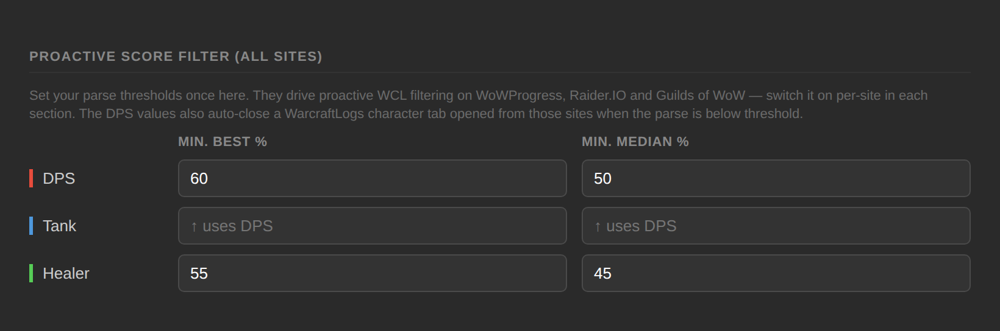
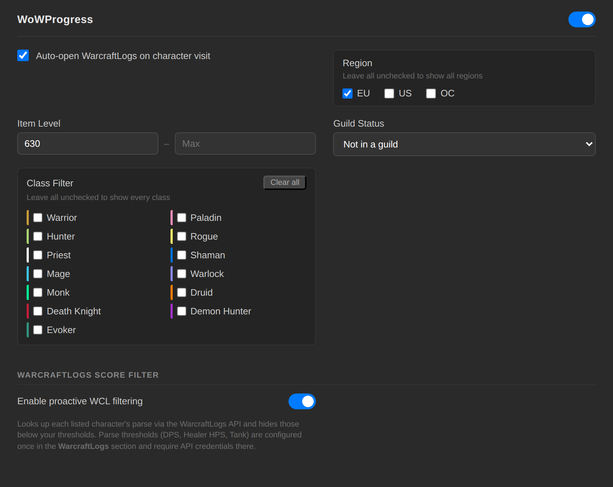

# WarcraftLogs API setup & proactive filtering

[← Back to README](../README.md)

Proactive filtering looks up parse scores *before you click*, directly on the
recruitment list pages. Characters below your thresholds are hidden, and every
visible candidate gets an inline badge showing their Best / Median parse.

It uses the official WarcraftLogs v2 API. The API is free; you just need to
create a client.

---

## Step 1 — Create a WarcraftLogs API client

1. Sign in at [warcraftlogs.com](https://www.warcraftlogs.com/)
2. Click your username → **Settings**
3. Scroll to **API clients (v2)** and click **Manage your API clients**
4. Click **Create client**
5. Give it any name (e.g. "RaidScout")
6. Set any redirect URL — `https://localhost` works fine; RaidScout never redirects
7. Click **Save** and copy the **Client ID** and **Client Secret** that appear

## Step 2 — Enter credentials in RaidScout

1. Click the RaidScout icon → **⚙ Full Settings**
2. Go to the **WarcraftLogs** tab
3. Paste your **Client ID** and **Client Secret** into the API Credentials fields
4. Click **Test connection** — you should see "✓ Connected successfully"
5. Click **Save**

The Client ID syncs across your Chrome devices. The Client Secret is stored
locally only and is never synced. It never leaves the extension's service
worker — content scripts only ever send a `{region, realm, name, role}` tuple.

## Step 3 — Set your thresholds once, then enable per site

Parse thresholds are configured a single time in the **WarcraftLogs** tab and
apply everywhere.

1. Set **Min. Best %** and **Min. Median %** on the **DPS** row
2. Optionally set separate values for **Healer** and **Tank** — see
   [Per-role thresholds](#per-role-thresholds) below
3. On each site's tab, toggle on **Enable proactive WCL filtering**
4. Click **Save**

The same DPS thresholds also drive the WarcraftLogs tab auto-close. Thresholds
take effect immediately on any open list pages, no refresh needed.

---

## Per-role thresholds

Healer HPS parses and DPS parses aren't directly comparable numbers, so
RaidScout scores each role on its own metric and lets you set thresholds per
role:

| Row | Metric | Applies to |
|---|---|---|
| **DPS** | DPS parse % | DPS characters, and tanks unless overridden |
| **Tank** | DPS parse % | Tanks only. Leave blank to reuse the DPS row |
| **Healer** | HPS parse % | Healers only |

Role is detected automatically. Raider.IO and Guilds of WoW have dependable
role markup and RaidScout reads it directly. On WoWProgress and the
WarcraftLogs recruitment search the markup isn't reliable, so RaidScout asks
the API to resolve the role from the spec the character actually ranked as
rather than guessing — a mis-guessed healer would otherwise be scored against a
DPS threshold they can never meet.

---

## Parse badges

Every scored candidate gets an inline badge on their row or card:

- **Green** — above your thresholds
- **Amber** — within 10% of a threshold
- **Red** — below threshold (hidden, unless you've revealed them)
- **📋 No logs** — no WarcraftLogs data; hidden, see below
- **⚠ WCL err** / **🚦 Rate limited** / **☁ CF check** — the lookup didn't
  answer, so the candidate stays visible

A filter summary bar above each list shows how many candidates were hidden.

---

## What gets hidden, and what never does

The rule draws a line between information about the **player** and information
about the **request**.

**Hidden:** a real score below your thresholds, and a character WarcraftLogs
has no parses for. An unparsed raider can't be judged against a parse minimum,
so they're below all of them. This applies whatever your settings are.

**Never hidden:** anything that failed. Missing credentials, a disabled
scoring toggle, a rate limit mid-run, a timeout, a Cloudflare challenge — all
of these say nothing about the player, so the candidate stays visible with a
badge explaining why. A misconfiguration can never empty a page.

The one exception is scouting: a candidate with no logs still gets their
WarcraftLogs tab opened. A list filter shortens a page you can go on reading,
whereas scouting decides whether you see a profile you deliberately navigated
to at all — and an empty profile is itself an answer.

---

## Caching and rate limits

Scores are cached for 6 hours per character and per role, so the same alt's DPS
and healer scores don't collide. Use **Clear cached scores** in the
WarcraftLogs tab to force fresh lookups. The TTL and the number of concurrent
lookups are both configurable under **Advanced** on that tab.

On an HTTP 429 RaidScout reads the `Retry-After` header and stops calling the
API until the cooldown expires, showing a countdown in the popup and Full
Settings rather than hammering a throttled endpoint.
